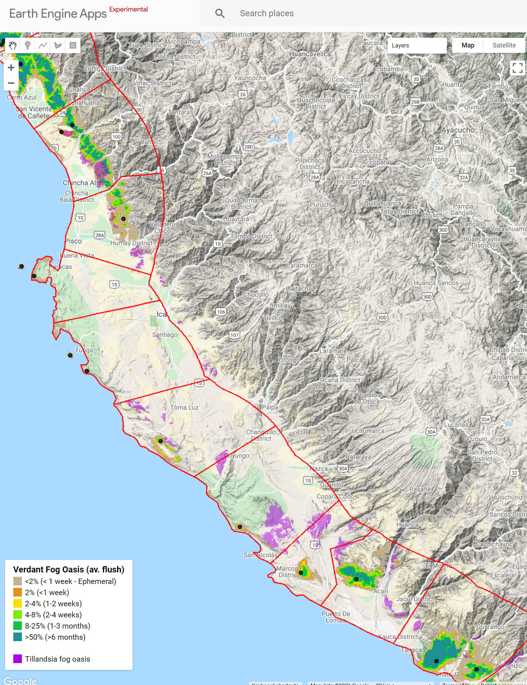

# Seeing through the cloud – mapping desert fog-oases habitats using 20 years of MODIS imagery over Peru and Chile

This is the repository for the paper "Seeing through the cloud – mapping desert fog-oases habitats using 20 years of MODIS imagery over Peru and Chile". Moat *et. al.* 2021

### Citation

Please cite as:

Moat, Justin, Alfonso Orellana-García, Carolina Tovar, Mónica Arakaki, César Arana, Asunción Cano, Luis Faundez, Martin Gardner, Paulina Hechenleitner, Josefina Hepp, Gwilym Lewis, José-Manuel Mamani, María Miyashiro, and Oliver Whaley. 2021. "Seeing through the Clouds - Mapping Desert Fog Oasis Ecosystems Using 20 Years of MODIS Imagery over Peru and Chile." *International Journal of Applied Earth Observations and Geoinformation.*

<https://www.researchgate.net/publication/354402653_Seeing_through_the_clouds_-Mapping_desert_fog_oasis_ecosystems_using_20_years_of_MODIS_imagery_over_Peru_and_Chile>

## Abstract

The desert fog oasis ecosystem of Peru and Chile comprises numerous oases along 3000 km of the Pacific coastal belt, it hosts a highly endemic flora, providing vital ecosystem services and genetic resources. However, due to their marked seasonality and fog cover they are poorly mapped, greatly compromising their conservation. Here we redress this using 479 images from the MODIS (MOD13Q1 V6 product) data/algorithm for the period 2000–2020, permitting the mapping of ephemeral vegetation, herbaceous and woody fog oases vegetation. In addition, we examine the main drivers of productivity in this unique ecosystem using generalised linear models, assess human pressures, conservation efforts, and summarise present plant diversity knowledge.

The resultant map (<https://gistin.users.earthengine.app/view/fogoasis>) extends existing mapped areas by more than four-fold to over 17,000 km2, revealing extensive little-known vegetation habitats with few or no collection records. *Tillandsia* ('air plants') fog oases were mapped manually due to poor spectral discrimination and were found to cover an area of approximately 1,900 km2 the majority of which is in Peru (96%). Fog oasis productivity is significantly related to aridity and distance to the coast, as well as elevation and slope angle. Most fog oases peak in productivity during August-September, although productivity is highly variable between August and December with different oases reacting to inter-annual and annual climate fluxes.

Only 4% of fog oases are protected, most are threatened by mining, urban development, air pollution and off-road 4 × 4 driving. Urgent action is needed to protect these areas, which we estimate support around 1200 ecosystem-specific flowering plant species with approximately 30% endemism in Peru and 67% in Chile. By presenting a comprehensive map and catalogue of Peruvian and Chilean fog oases, we hope to catalyse increased conservation and research towards a better understanding of these exceptional ecosystems within South America.

### 

### Data

-   Verdant fog oasis as geotiff map:  <https://github.com/gistin/fog-oases/blob/main/data/fog_oasis_verdant2021.tif>

-   *Tillandsia* fog oasis as geotiff map:  <https://github.com/gistin/fog-oases/blob/main/data/fog_oasis_verdant2021.tif>

-   *Fog oasis sites as ESRI shapefile: <https://github.com/gistin/fog-oases/tree/main/data>/FO_locs2021.\**

-   *Fog oasis regions as ESRI shapefile: <https://github.com/gistin/fog-oases/tree/main/data>/Fo_regions2021.\**

-   Fog oasis sites, see supplementary excel file,sheet "1 Fog Oasis sites" Fog oasis region names and sites, see supplementary excel file, sheet "2 Region names and sites" <https://github.com/gistin/fog-oases/blob/main/data/Sub%20information.xlsx>

-   Fog oasis regions area (summary in table 3, figs. 2 and 3), see supplementary excel file, sheet "3 Fog Oasis area (km2)" <https://github.com/gistin/fog-oases/blob/main/data/Sub%20information.xlsx>

### Figures

-   [Fig. 1.](https://github.com/gistin/fog-oases/blob/main/figures/Figure%201%20localities.jpg) Map of fog oasis sites (botanical collection sites) and protected areas of Peru and Chile.

-   [Fig. 2.](https://github.com/gistin/fog-oases/blob/main/figures/Figure%202%20Fog%20Oasis.jpg) Map of the verdant and *Tillandsia* fog oases of Peru and Chile, names are given as unique region identifiers, 1 to 60. A 10 km shade zone has been applied to the fog oases to highlight smaller areas beyond print resolution. Transitional areas are not highlighted.

-   [Fig. 3.](https://github.com/gistin/fog-oases/blob/main/figures/Figure%203%20Fog%20Oasis%20charactisation.jpg) Summary Infographic of fog oases characteristics. Left to right: Extent (shades of green), area of core verdant oasis (km2), area of ephemeral verdant oasis (square symbol size indicates proportion), area of Tillandsia fog oasis (km2). Characteristics (shades of blue): aridity index, elevation (m), distance from coastline (km), slope angle (degrees), slope direction (arrows show direction). Analysis (red to blue): duration of season (NDVI \>0.15), peak month (as number), isolation (km). Impacts and knowledge (shades of purple to blue-grey): protection (% of protected area), human footprint (global scale of 0–50) and approximate number of plant species recorded. N.B. maps rotated 28˚from north.

-   [Fig S1.](https://github.com/gistin/fog-oases/blob/main/figures/Figure%20S1%20Fog%20Oasis%20area.jpg) Stacked bar chart of areas of verdant fog and *Tillandsia* oases in km2. Region identifiers and names are given with a unique region number from 1 to 60 running from north to south (see figure 2 for detail).

-   [Fig S2.](https://github.com/gistin/fog-oases/blob/main/figures/Figure%20S2.jpg) Whisker plots for the core verdant fog oases characterisation analysis.

### Google earth engine code

1.  [GEE setup baseline data and analysis](https://github.com/gistin/fog-oases/blob/main/1%20GEE%20setup%20and%20get%20base%20data.js)

2.  [GEE Map](https://github.com/gistin/fog-oases/blob/main/2%20GEE%20map%20the%20data%20(for%20app).js)

3.  [GEE zonal statistics](https://github.com/gistin/fog-oases/blob/main/3%20GEE%20zonal%20statisitc%20to%20export.js)

### Google earth engine interactive map

Interactive google earth engine maps: <https://gistin.users.earthengine.app/view/fogoasis>

To highlight and zoom to a region: [https://gistin.users.earthengine.app/view/fogoasis\\\#regionid=](https://gistin.users.earthengine.app/view/fogoasis\#regionid=)?

To zoom to a point: [https://gistin.users.earthengine.app/view/fogoasis\\\#llz=lat](https://gistin.users.earthengine.app/view/fogoasis\#llz=lat)?,long?,zoomlevel?

**Examples:**

Region Ocoña[34]: <https://gistin.users.earthengine.app/view/fogoasis#regionid=34> Villa María:  <https://gistin.users.earthengine.app/view/fogoasis#llz=-12.135,-76.915,11>
